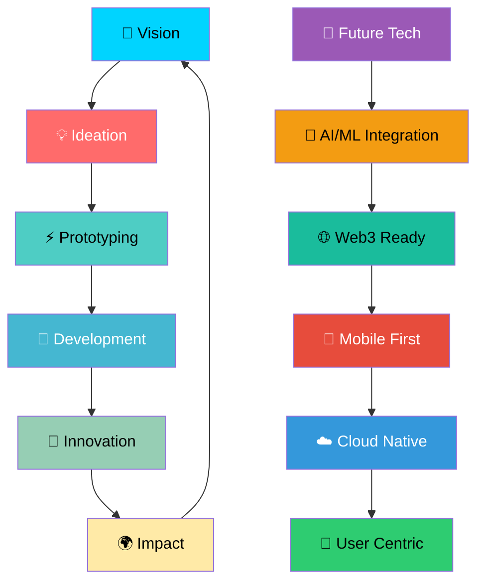

<div align="center">

# 🚀 Hi there, I'm Kanneboina Shiva Kumar! 

[](https://github.com/Kanneboinashivakumar)
[](https://github.com/Kanneboinashivakumar?tab=followers)
[](https://github.com/Kanneboinashivakumar?tab=repositories)


</div>

---

## 👨‍💻 About Me

```python
class SoftwareDeveloper:
def init(self):
self.name = "Kanneboina Shiva Kumar"
self.role = "BTech 3rd Year Student,Full Stack Developer & ML Enthusiast"
self.location = "India 🇮🇳"
self.passions = ["Web Development", "Machine Learning", "Open Source", "Innovation"]
self.current_focus = "Building LokSathi - India's first citizen companion"

def say_hi(self):
    print("My programs run seamlessly, letting bugs sleep in peace 😴")
me = DataScientist()
me.say_hi()
```

- 🔭 **Currently working on:** LokSathi – India's first citizen companion.
- 🌱 **Learning:** Machine Learning & Advanced DSA with hands-on projects.
- 💡 **Interests:** Full-Stack Development, AI/ML, Open Source, Problem Solving.
- 🤝 **Looking to collaborate on:** Innovative projects that create impact.
- 🎯 **2025 Goals:** Master ML algorithms, Contribute to 5+ open source projects .
- 📫 **Reach me:** [](https://linkedin.com/in/ShivaKumarKanneboina) [](mailto:beginsample36@gmail.com)
- ⚡ **Fun fact:** I once debugged for 3 hours only to find a missing semicolon 😅.

---

## 🛠️ Tech Stack & Tools

### 💻 Languages


### 📚 Frameworks & Libraries


### 🛠️ Tools & Platforms


---

## 📊 GitHub Analytics

<p align="center">
  
  
</p>

<p align="center">
  
</p>


<p align="center">
  
</p>

---

## 🚀 Featured Projects

| 🎯 LokSathi - Citizen Companion | 🌐 BharatAkshar - Language Platform |
|--------------------------------|------------------------------------|
| [](https://github.com/Kanneboinashivakumar) | [](https://kanneboinashivakumar.github.io/BharatAkshar/) [](https://github.com/Kanneboinashivakumar/BharatAkshar) |
| India's first comprehensive citizen companion platform | Multi-language Indian learning platform with transliteration |
| **Tech Stack:** React • Node.js • MongoDB • Python • ML | **Tech Stack:** HTML5 • CSS3 • JavaScript • Python |
| **✨ Features:** | **✨ Features:** |
| • Citizen services integration | • Multiple Indian languages |
| • Real-time updates | • Interactive learning |
| • Multi-language support | • Cultural integration |
| • AI-powered assistance | • Progress tracking |
|   |   |

| 💼 Personal Portfolio | 🤖 ML Projects Collection |
|-----------------------|---------------------------|
| [](https://kanneboinashivakumar.github.io/portfolio/) [](https://github.com/Kanneboinashivakumar/portfolio) | [](https://github.com/Kanneboinashivakumar) |
| Modern portfolio with interactive elements | Various Machine Learning implementations |
| **Tech Stack:** HTML5 • CSS3 • JavaScript • GSAP | **Tech Stack:** Python • Scikit-learn • TensorFlow • Pandas • NumPy |
| **✨ Features:** | **✨ Features:** |
| • Smooth animations | • Data preprocessing |
| • Responsive design | • Model training |
| • Project showcase | • Visualization |
| • Contact integration | • Performance metrics |
|   |   |

---

## 🏆 Achievements & Certifications

<p align="center">
  
</p>

- ✅ LokSathi Developer – Building India’s first citizen companion platform
- ✅ Smart India Hackathon Participant – Techlead of Bharat Akshar, an innovative transliteration app
- ✅ Multi-language Programmer – Proficient in 5+ programming languages
- ✅ Open Source Contributor – Actively contributing to community projects
- 🎯 Problem Solver – Strong DSA and algorithmic thinking skills

---

## 💼 Skills Matrix

```text
Full Stack Development   ██████████████████░░ 90%
Machine Learning         ███████████████░░░░░ 75%
Data Structures          █████████████████░░░ 85%
Python Programming       ██████████████████░░ 90%
JavaScript/React         ████████████████░░░░ 80%
Database Design          █████████████████░░░ 85%
Problem Solving          ███████████████████░ 95%
Team Collaboration       █████████████████░░░ 85%
```

---

## 📈 Coding Activity

```text

🌅 Morning     ██████████░░░░░░░ 40%
🌆 Daytime     █████████████░░░░ 65%
🌃 Evening     ████████░░░░░░░░░ 35%
🌙 Night       ████░░░░░░░░░░░░░ 70%
```

---

### 🎛️ Live Innovation Control Panel

<p align="center">


</p>


## 💡 Quote of the Day

<div align="center">


</div>

---

## 🤝 Let's Connect!

<div align="center">

[](https://www.linkedin.com/in/shiva-kumar-kannaeboina-b6a844298/)
[](https://kanneboinashivakumar.github.io/portfolio/)
[](mailto:beginsample36@gmail.com)
[](https://github.com/Kanneboinashivakumar)

</div>

---

<div align="center">

### 💭 "First, solve the problem. Then, write the code." – John Johnson

### ⭐️ From [Kanneboinashivakumar](https://github.com/Kanneboinashivakumar) | 🚀 Building the future, one commit at a time! 

</div>

---

## Snake animation

<picture>
  <source
    media="(prefers-color-scheme: dark)"
    srcset="https://raw.githubusercontent.com/platane/snk/output/github-contribution-grid-snake-dark.svg"
  />
  <source
    media="(prefers-color-scheme: light)"
    srcset="https://raw.githubusercontent.com/platane/snk/output/github-contribution-grid-snake.svg"
  />
  
</picture>

---


