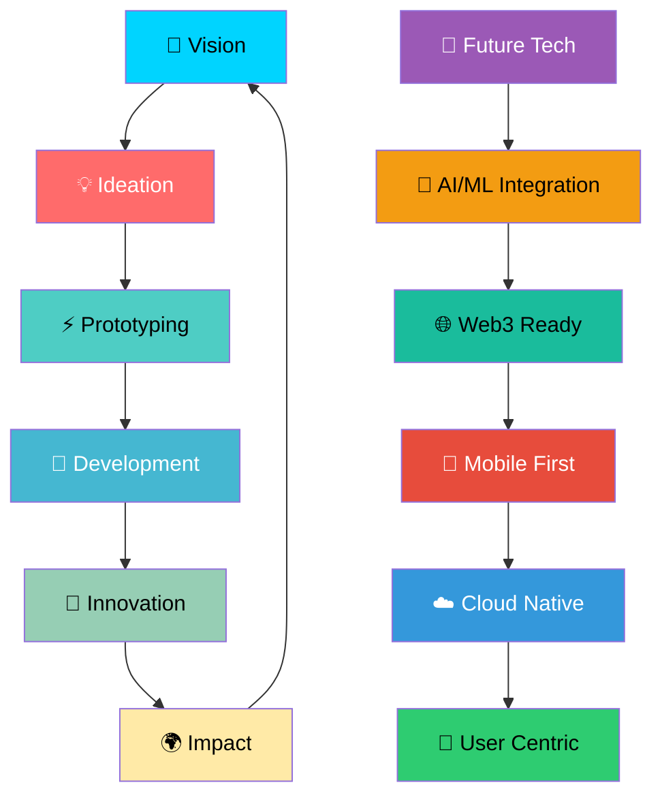

<p align="center">
  
</p>


<div align="center">
  
# 🚀 Hi there, I'm Kanneboina Shiva Kumar! 


[](https://github.com/Kanneboinashivakumar)
[](https://github.com/Kanneboinashivakumar?tab=followers)
[](https://github.com/Kanneboinashivakumar?tab=repositories)


</div>

---

## 👨‍💻 About Me

```python
class SoftwareDeveloper:
    def __init__(self):
        self.name = "Kanneboina Shiva Kumar"
        self.role = "BTech 3rd Year Student, Full Stack Developer & ML Enthusiast"
        self.location = "India 🇮🇳"
        self.passions = ["Web Development", "Machine Learning", "Open Source", "Innovation"]
        self.current_focus = "Building LokSathi & LIFEOS"

    def say_hi(self):
        print("My programs run seamlessly, letting bugs sleep in peace 😴")

me = SoftwareDeveloper()
me.say_hi()
```
| 💬 **Code & Curiosity** | 🎞️ **Visual Vibe** |
|-----------------|-------------------|
| 🔭 **Currently working on:** LokSathi (Citizen Companion) & [LIFEOS](https://github.com/Kanneboinashivakumar/LifeOS) (Gamified RPG Productivity Hub).<br>🌱 **Learning:** Advanced Machine Learning, System Architecture, & Cloud Engineering.<br>💡 **Interests:** Full-Stack Development, AI/ML, Open Source, Performance Optimization.<br>🤝 **Looking to collaborate on:** High-impact platforms and developer tooling.<br>🎯 **Goals:** Expand LIFEOS features, deploy production containers, and contribute to community projects.<br>📫 **Reach me:** [](https://linkedin.com/in/ShivaKumarKanneboina) [](mailto:beginsample36@gmail.com)<br>🛠️ **Open Source:** Contributing to BharatAkshar, WGER, and other systems.<br>🚀 **Projects:** Scaled web apps and containerized deployments.<br>📚 **Skills:** Advanced TypeScript, Next.js standalone builds, Docker, and GCP.<br>⚡ **Fun fact:** I once spent 3 hours debugging only to find out a regional formatting hydration mismatch 😅. |  |

---

## 🛠️ Tech Stack & Tools

### 💻 Languages


### 📚 Frameworks & Libraries


### 🛠️ Tools & Platforms


---

## 📊 GitHub Analytics

<p align="center">
  
  
</p>

<p align="center">
  
</p>

### 🔝 Top Contributed Repo
<p align="center">
  
</p>

---

## 🚀 Featured Projects

| 🎯 LokSathi - Citizen Companion | 🌌 LIFEOS - Gamified RPG Productivity |
|--------------------------------|--------------------------------------|
| [](https://github.com/Kanneboinashivakumar) | [](https://lifeos-app-179120008102.us-central1.run.app/) [](https://github.com/Kanneboinashivakumar/LifeOS) |
| India's first comprehensive citizen companion platform | Gamified Personal Growth RPG & Deep Work Hub |
| **Tech Stack:** React • Node.js • MongoDB • Python • ML | **Tech Stack:** Next.js 16 • React 19 • Tailwind CSS v4 • Framer Motion • Spline 3D • Docker • GCP |
| **✨ Features:** | **✨ Features:** |
| • Citizen services integration | • Interactive mouse-following 3D robot interface |
| • Real-time notifications and updates | • Pomodoro focus protocols with active XP gains |
| • Multi-language interface support | • Dynamic consistency streaks & rank multipliers |
| • AI-powered client assistance | • Production containerized Cloud Run orchestration |
|   |   |

| 🌐 BharatAkshar - Language Platform | 🤖 ML Projects Collection |
|------------------------------------|---------------------------|
| [](https://kanneboinashivakumar.github.io/BharatAkshar/) [](https://github.com/Kanneboinashivakumar/BharatAkshar) | [](https://github.com/Kanneboinashivakumar) |
| Multi-language Indian learning platform with transliteration | Various Machine Learning implementations |
| **Tech Stack:** HTML5 • CSS3 • JavaScript • Python | **Tech Stack:** Python • Scikit-learn • TensorFlow • Pandas • NumPy |
| **✨ Features:** | **✨ Features:** |
| • Multiple Indian languages support | • Advanced data preprocessing pipelines |
| • Interactive learning and games | • Predictive models training and evaluation |
| • Cultural and regional integration | • Live visualizations and telemetry |
| • Learning progress tracking | • Performance metrics logs |
|   |   |

| 💼 Personal Portfolio | |
|-----------------------|---|
| [](https://kanneboinashivakumar.github.io/portfolio/) [](https://github.com/Kanneboinashivakumar/portfolio) | |
| Modern portfolio with interactive elements | |
| **Tech Stack:** HTML5 • CSS3 • JavaScript • GSAP | |
| **✨ Features:** | |
| • Smooth scrolling and transitions | |
| • Responsive layout mechanics | |
| • Detailed project showcase grid | |
| • Contact form integration | |
|   | |

---

## 🏆 Achievements & Certifications

<p align="center">
  
</p>

- ✅ LokSathi Developer – Building India’s first citizen companion platform
- ✅ Smart India Hackathon Participant – Techlead of Bharat Akshar, an innovative transliteration app
- ✅ Multi-language Programmer – Proficient in 5+ programming languages
- ✅ Open Source Contributor – Actively contributing to community projects
- 🎯 Problem Solver – Strong DSA and algorithmic thinking skills

---

## 💼 Skills Matrix

```text
Full Stack Development   ██████████████████░░ 90%
Machine Learning         ███████████████░░░░░ 75%
Data Structures          █████████████████░░░ 85%
Python Programming       ██████████████████░░ 90%
JavaScript/React         ████████████████░░░░ 80%
Database Design          █████████████████░░░ 85%
Problem Solving          ███████████████████░ 95%
Team Collaboration       █████████████████░░░ 85%
```

---

## 📈 Coding Activity

```text

🌅 Morning     ██████████░░░░░░░ 40%
🌆 Daytime     █████████████░░░░ 65%
🌃 Evening     ████████░░░░░░░░░ 35%
🌙 Night       ██████████████░░░ 70%
```

---

### 🎛️ Live Innovation Control Panel

<p align="center">


```mermaid
graph TB
    %% Main Innovation Workflow
    A[🎯 Vision] --> B[💡 Ideation]
    B --> C[⚡ Prototyping]
    C --> D[🚀 Development]
    D --> E[🎨 Innovation]
    E --> F[🌍 Impact]
    F --> A
    
    %% Future Tech Workflow
    A1[🔮 Future Tech] --> B1[🤖 AI/ML Integration]
    B1 --> C1[🌐 Web3 Ready]
    C1 --> D1[📱 Mobile First]
    D1 --> E1[☁️ Cloud Native]
    E1 --> F1[🎯 User Centric]
    
    %% Main workflow colors
    style A fill:#00D4FF,color:#000
    style B fill:#FF6B6B,color:#fff
    style C fill:#4ECDC4,color:#000
    style D fill:#45B7D1,color:#fff
    style E fill:#96CEB4,color:#000
    style F fill:#FFEAA7,color:#000

    %% Future Tech colors
    style A1 fill:#9B59B6,color:#fff
    style B1 fill:#F39C12,color:#000
    style C1 fill:#1ABC9C,color:#000
    style D1 fill:#E74C3C,color:#fff
    style E1 fill:#3498DB,color:#fff
    style F1 fill:#2ECC71,color:#000
```
</p>


## 💡 Quote of the Day

<div align="center">


</div>

---

## 🤝 Let's Connect!

<div align="center">


<br>
<br>

[](https://www.linkedin.com/in/shiva-kumar-kannaeboina-b6a844298/)
[](https://kanneboinashivakumar.github.io/portfolio/)
[](mailto:beginsample36@gmail.com)
[](https://github.com/Kanneboinashivakumar)

</div>

---

<div align="center">

### 💭 "First, solve the problem. Then, write the code." – John Johnson

### ⭐️ From [Kanneboinashivakumar](https://github.com/Kanneboinashivakumar) | 🚀 Building the future, one commit at a time! 

</div>

---

## Snake animation

<picture>
  <source
    media="(prefers-color-scheme: dark)"
    srcset="https://raw.githubusercontent.com/platane/snk/output/github-contribution-grid-snake-dark.svg"
  />
  <source
    media="(prefers-color-scheme: light)"
    srcset="https://raw.githubusercontent.com/platane/snk/output/github-contribution-grid-snake.svg"
  />
  
</picture>

---


