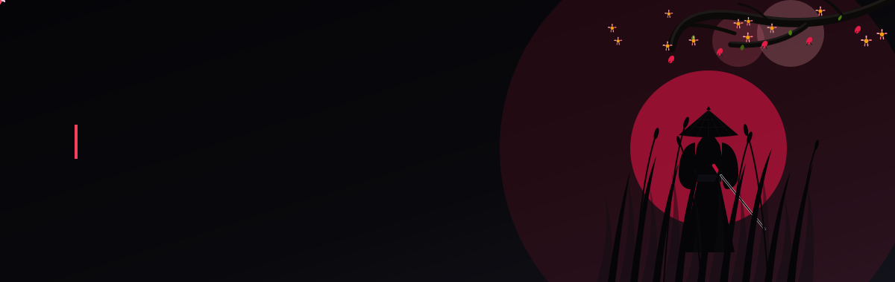
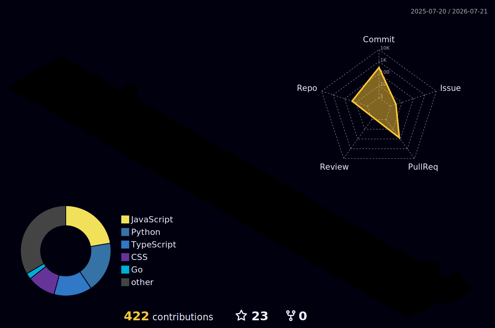
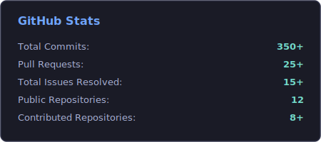
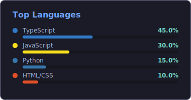
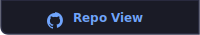
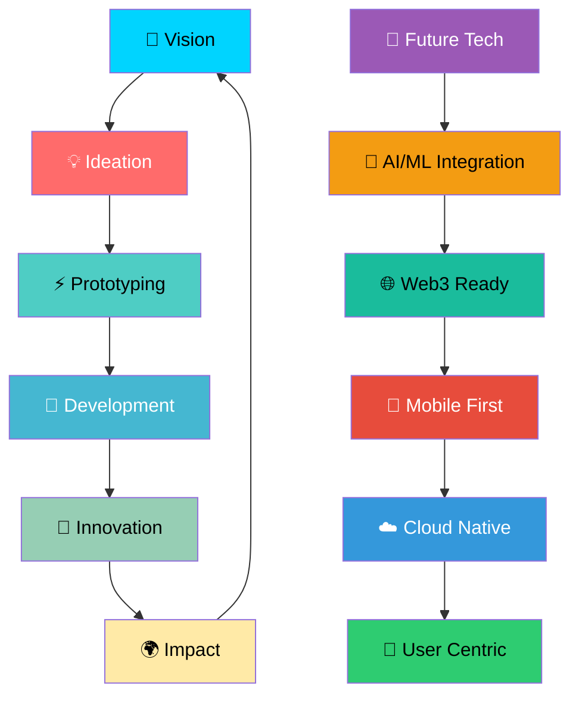

<p align="center">
  
</p>


<div align="center">


<br><br>

[](https://github.com/Kanneboinashivakumar)
[](https://github.com/Kanneboinashivakumar?tab=followers)
[](https://github.com/Kanneboinashivakumar?tab=repositories)

</div>

---

## 👨‍💻 About Me

```python
class SoftwareDeveloper:
    def __init__(self):
        self.name = "Kanneboina Shiva Kumar"
        self.role = "BTech 3rd Year Student, Full Stack Developer & ML Enthusiast"
        self.location = "India 🇮🇳"
        self.passions = ["Web Development", "Machine Learning", "Open Source", "Innovation"]
        self.current_focus = "Building LokSathi & LIFEOS"

    def say_hi(self):
        print("My programs run seamlessly, letting bugs sleep in peace 😴")

me = SoftwareDeveloper()
me.say_hi()
```

| 💬 **Code & Curiosity** | 🎞️ **Visual Vibe** |
| :--- | :--- |
| 🔭 **Currently working on:** LokSathi (Citizen Companion) & [LIFEOS](https://github.com/Kanneboinashivakumar/LifeOS) (Gamified RPG Productivity Hub).<br>🌱 **Learning:** Advanced Machine Learning, System Architecture, & Cloud Engineering.<br>💡 **Interests:** Full-Stack Development, AI/ML, Open Source, Performance Optimization.<br>🤝 **Looking to collaborate on:** High-impact platforms and developer tooling.<br>🎯 **Goals:** Expand LIFEOS features, deploy production containers, and contribute to community projects.<br>📫 **Reach me:** [](https://www.linkedin.com/in/shiva-kumar-kannaeboina-b6a844298/) [](mailto:beginsample36@gmail.com)<br>🛠️ **Open Source:** Contributing to BharatAkshar, WGER, and other systems.<br>🚀 **Projects:** Scaled web apps and containerized deployments.<br>📚 **Skills:** Advanced TypeScript, Next.js standalone builds, Docker, and GCP.<br>⚡ **Fun fact:** I once spent 3 hours debugging only to find out a regional formatting hydration mismatch 😅. |  |


---

## 🛠️ Tech Stack & Tools

### 💻 Languages


### 📚 Frameworks & Libraries


### 🛠️ Tools & Platforms


---

## 📊 GitHub Analytics

<p align="center">
  
</p>

<p align="center">
  
  
</p>

<p align="center">
  
</p>

---

## 🚀 Featured Projects

<table border="0" cellpadding="0" cellspacing="0" width="100%">
  <tr>
    <!-- Row 1, Column 1 (NexQueue) -->
    <td valign="top" width="48%" align="center">
      <a href="https://github.com/Kanneboinashivakumar/nexqueue"></a>
      <a href="https://github.com/Kanneboinashivakumar/nexqueue"></a>
    </td>
    <!-- Spacer Column -->
    <td width="4%"></td>
    <!-- Row 1, Column 2 (LIFEOS) -->
    <td valign="top" width="48%" align="center">
      <a href="https://github.com/Kanneboinashivakumar/LifeOS"></a>
      <a href="https://github.com/Kanneboinashivakumar/LifeOS"></a>&nbsp;<a href="https://lifeos-app-179120008102.us-central1.run.app/"></a>
    </td>
  </tr>
  <tr><td height="24" colspan="3"></td></tr> <!-- Spacer Row -->
  <tr>
    <!-- Row 2, Column 1 (LokSathi) -->
    <td valign="top" align="center">
      <a href="https://github.com/Kanneboinashivakumar"></a>
      <a href="https://github.com/Kanneboinashivakumar"></a>
    </td>
    <!-- Spacer Column -->
    <td></td>
    <!-- Row 2, Column 2 (BharatAkshar) -->
    <td valign="top" align="center">
      <a href="https://github.com/Kanneboinashivakumar/BharatAkshar"></a>
      <a href="https://github.com/Kanneboinashivakumar/BharatAkshar"></a>&nbsp;<a href="https://kanneboinashivakumar.github.io/BharatAkshar/"></a>
    </td>
  </tr>
  <tr><td height="24" colspan="3"></td></tr> <!-- Spacer Row -->
  <tr>
    <!-- Row 3, Column 1 (Portfolio) -->
    <td valign="top" align="center">
      <a href="https://github.com/Kanneboinashivakumar/portfolio"></a>
      <a href="https://github.com/Kanneboinashivakumar/portfolio"></a>&nbsp;<a href="https://kanneboinashivakumar.github.io/portfolio/"></a>
    </td>
    <!-- Spacer Column -->
    <td></td>
    <!-- Row 3, Column 2 (ML Projects) -->
    <td valign="top" align="center">
      <a href="https://github.com/Kanneboinashivakumar"></a>
      <a href="https://github.com/Kanneboinashivakumar"></a>
    </td>
  </tr>
</table>

---

## 🏆 Achievements

<div align="center">
  
  
  
  
</div>

<br>

- ✅ **LokSathi Developer** – Building India’s first citizen companion platform
- ✅ **Smart India Hackathon Participant** – Techlead of Bharat Akshar, an innovative transliteration app
- ✅ **Multi-language Programmer** – Proficient in 5+ programming languages
- ✅ **Open Source Contributor** – Actively contributing to community projects
- 🎯 **Problem Solver** – Strong DSA and algorithmic thinking skills

---

## 💼 Skills Matrix

<p align="center">
  
</p>
 
---
 
## 📈 Coding Activity
 
<p align="center">
  
</p>

---

### 🎛️ Live Innovation Control Panel

<p align="center">


```mermaid
graph TB
    %% Main Innovation Workflow
    A[🎯 Vision] --> B[💡 Ideation]
    B --> C[⚡ Prototyping]
    C --> D[🚀 Development]
    D --> E[🎨 Innovation]
    E --> F[🌍 Impact]
    F --> A
    
    %% Future Tech Workflow
    A1[🔮 Future Tech] --> B1[🤖 AI/ML Integration]
    B1 --> C1[🌐 Web3 Ready]
    C1 --> D1[📱 Mobile First]
    D1 --> E1[☁️ Cloud Native]
    E1 --> F1[🎯 User Centric]
    
    %% Main workflow colors
    style A fill:#00D4FF,color:#000
    style B fill:#FF6B6B,color:#fff
    style C fill:#4ECDC4,color:#000
    style D fill:#45B7D1,color:#fff
    style E fill:#96CEB4,color:#000
    style F fill:#FFEAA7,color:#000

    %% Future Tech colors
    style A1 fill:#9B59B6,color:#fff
    style B1 fill:#F39C12,color:#000
    style C1 fill:#1ABC9C,color:#000
    style D1 fill:#E74C3C,color:#fff
    style E1 fill:#3498DB,color:#fff
    style F1 fill:#2ECC71,color:#000
```
</p>


## 💡 Quote of the Day

<div align="center">


</div>

---

<p align="center">
  <a href="https://github.com/ryo-ma/github-profile-trophy">
    
  </a>
</p>

---

## Snake animation

<picture>
  <source
    media="(prefers-color-scheme: dark)"
    srcset="https://raw.githubusercontent.com/platane/snk/output/github-contribution-grid-snake-dark.svg"
  />
  <source
    media="(prefers-color-scheme: light)"
    srcset="https://raw.githubusercontent.com/platane/snk/output/github-contribution-grid-snake.svg"
  />
  
</picture>

---


